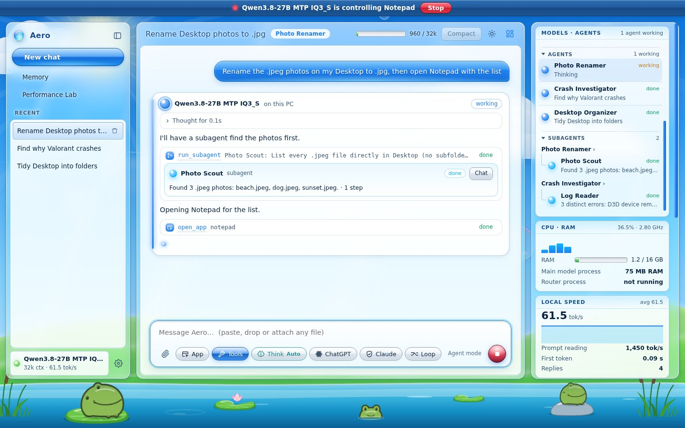
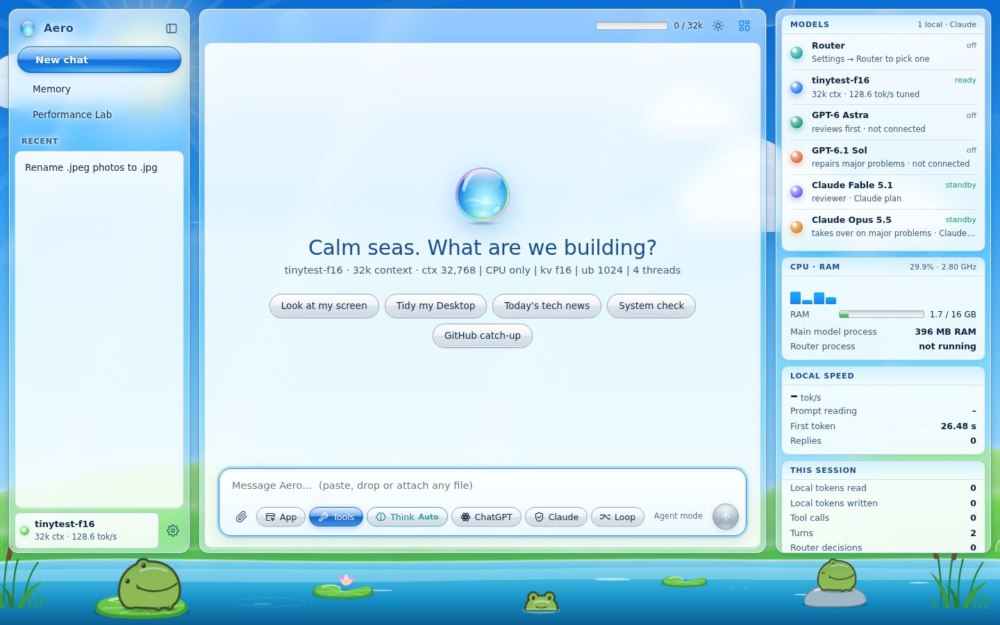
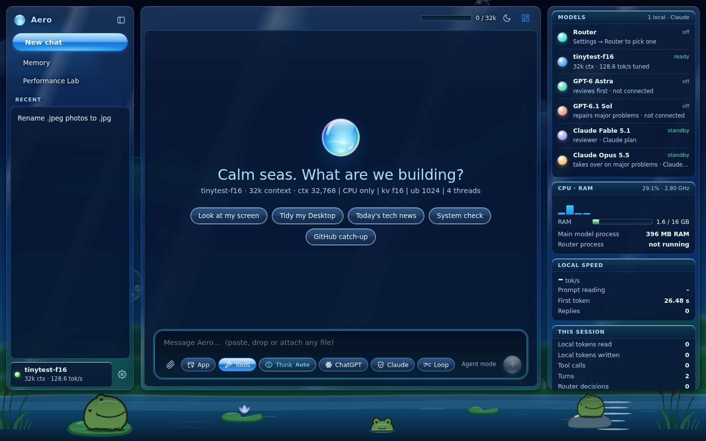
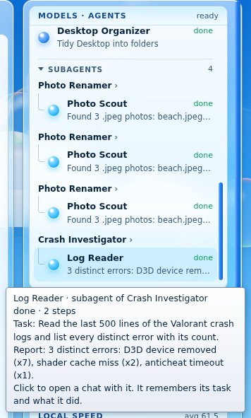
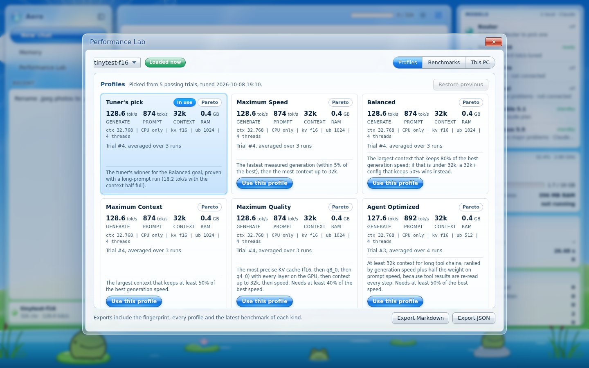

# Aero

**The Frutiger Aero, lightweight and efficient local LLM bootstrapper for Windows, Linux and macOS.**

Aero scans your computer, picks a model and quant that fit it, installs the right llama.cpp build for your GPU
(NVIDIA, AMD, Intel, Apple Silicon or none), tunes the model to the VRAM you allow, and gives you a local agent that
can use your files, shell, screen, apps and browser. Everything local runs on 127.0.0.1, and with **strict offline**
on, nothing leaves the computer at all. When you want a second opinion, ChatGPT and/or Claude review the finished
work, and your local model learns from what they found.



## Download and install

Get the file for your system from the [latest release](https://github.com/NermalYT/Aero/releases/latest).

| System | Download | Then |
| --- | --- | --- |
| **Windows** 10 / 11 (64-bit) | `Aero-windows.zip` | Extract it, double-click **`Update-Aero.bat`**, accept the admin prompt. Installs into `C:\Aero`. |
| **macOS** (Apple Silicon or Intel) | `Aero-macos.zip` | Unzip it, right-click **`Install-Aero.command`** → Open. Adds `~/Applications/Aero.app`. |
| **Linux**, any distro | one line in a terminal (below) | Installs for your user into `~/.local/share/aero`, with an app-menu entry and the `aero` command. |
| Debian, Ubuntu, Mint, Pop!_OS | `aero_<version>_all.deb` | `sudo apt install ./aero_*_all.deb`, then start Aero from the app menu or run `aero`. |
| Fedora, RHEL, Rocky, Alma, openSUSE | `aero-<version>-1.noarch.rpm` | `sudo dnf install ./aero-*.rpm` (openSUSE: `sudo zypper install ./aero-*.rpm`), then run `aero`. |
| Arch, Manjaro, EndeavourOS | `PKGBUILD` | `makepkg -si` in a folder holding the `PKGBUILD`, then run `aero`. |

Linux and macOS, one line (downloads the newest release and installs it):

```sh
curl -fsSL https://github.com/NermalYT/Aero/releases/latest/download/install.sh | sh
```

The installer finds your package manager (apt, dnf, zypper, pacman, apk, xbps, eopkg, emerge, swupd or Homebrew),
shows the command before it installs anything missing (Python 3.10+, the Vulkan loader, the OpenMP runtime) and
asks first. It never needs to run as root. Then the model chooser recommends a model for your computer, and Aero
opens. `sh install.sh --help` lists its options.

**Updates:** Aero checks GitHub for a newer release once when it starts. **Update now** downloads it, verifies its
checksum and installs it; models, chats, memory, settings, mods and tunings are kept.

**Needs:** 8 GB RAM or more (16 GB is comfortable) and an internet connection for the install and model downloads.
A GPU is optional. An install under Aero's earlier names (`C:\Halcyon` or `C:\VRAMpire`) is moved to `C:\Aero` with
everything in it.

## What it does

- **Fits any PC.** Reads the GPUs (live VRAM on NVIDIA; the driver's VRAM size on AMD and Intel), RAM and CPU, then
  recommends the largest-quality model that fits: fully on the GPU, MoE experts in system RAM, or CPU only.
- **Tunes for real.** Measures llama.cpp settings on your PC within a VRAM limit you choose. HAPO turns the measured
  trials into profiles (Maximum Speed, Balanced, Maximum Context, Maximum Quality, Agent Optimized, Efficiency).
- **A tiny router on the CPU** reads each request first and gives the main model only the tools it needs.
- **Agents and subagents.** Each chat's task gets an agent named for what it does ("Photo Renamer", "Crash
  Investigator"). An agent can hand a self-contained part of the job to a subagent (a fresh copy of the local model
  with its own context) and gets back its report. The dashboard lists models, agents and subagents in one scrolling
  card: hover for what each is doing, click to talk to it.
- **You always know when it's driving.** While a model clicks, types or opens apps, a header across the top of Aero
  and a banner over the app it's using say "*model* is controlling *app*", each with a **Stop** button.
- **Optional cloud reviews, two buttons.** **ChatGPT**: GPT-6 Astra reviews, GPT-6.1 Sol repairs. **Claude**: Claude
  Fable 5.1 reviews, Claude Opus 5.5 repairs. With both on, ChatGPT goes first and Claude reviews the final state with
  ChatGPT's findings. Every problem found becomes a lesson for your local model. Connect with an API key or your
  ChatGPT / Claude plan through the official Codex CLI / Claude Code sign-in.
- **Local Only: On / Off.** One button next to ChatGPT, Claude and Loop. On, the model answers by itself with no
  web, browser, MCP servers or cloud reviews. Off, it searches and reads the web when a task needs it.
- **Strict offline.** Blocks every non-loopback request inside Aero, skips cloud reviews, hides network tools and
  keeps an audit log. Local chat keeps working with no network at all.
- **Performance Lab.** Benchmarks (time to first token, prefill, decode, long-context recall, JSON and tool-call
  accuracy), a router suite, and a test of what the scenery costs your generation speed. Real measurements only.
- **Mod Aero.** Describe a change to Aero in plain words and your local model makes it in a copy of Aero's code.
  Aero compiles it, runs its tests and starts a test copy before you can apply it, shows the diff, and can turn it
  off or undo it any time. A mod that breaks startup is undone automatically. Mods carry over to new versions.
- **Forever-loop with a journal.** The ∞ Loop repeats a task until you stop it. After every round the model writes
  down what worked, what didn't and what to do next, and the next round starts from that, so it improves its own
  workflow as it goes.
- **Models learn from each other.** Aero records which tools worked or failed on each task and which model did it,
  and the model writes notes when something goes wrong or you give feedback. Whichever model you load later gets
  the notes from similar tasks, and every model knows your stated preferences.
- **Frutiger Aero.** Glass over a day or night landscape with a frog pond. Scenery Full, Still or Off; it pauses
  while a model is working.

| Day | Night |
|---|---|
|  |  |

| Talking to a subagent | Models, agents and subagents |
|---|---|
|  |  |

| Both review passes (demo chat) | Performance Lab |
|---|---|
|  |  |

| Narrow window |
|---|
|  |


## Documentation

- [Full manual](source/README.md): install, the model chooser, connecting ChatGPT and Claude, offline and privacy,
  tools, troubleshooting.
- [Changelog](source/CHANGELOG.md)
- [Validation report](source/docs/VALIDATION_REPORT.md): what has been tested, and what still needs a Windows PC.
- [Local execution audit](source/docs/LOCAL_EXECUTION_AUDIT.md), [HAPO](source/docs/HAPO_ARCHITECTURE.md),
  [performance report](source/docs/PERFORMANCE_REPORT.md), [inference research](source/docs/INFERENCE_RESEARCH.md),
  [design system](source/docs/AERO_DESIGN_SYSTEM.md).

## Status

1.0.0 is the first public release. Its automated tests, a live run of the UI, a real self-update in a container,
and installs from the release files on Ubuntu 24.04 and 22.04, Fedora 42 and Arch Linux passed (containers, no GPU). Windows, macOS, GPU speeds and real ChatGPT and Claude calls have not been tested yet;
see the [validation report](source/docs/VALIDATION_REPORT.md). To check a Windows install without changing it:

```powershell
powershell -ExecutionPolicy Bypass -File C:\Aero\app\validation\Validate-Aero.ps1 -OpenUI
```

## Development

The app is Python (FastAPI) in `source/aero`, with the UI in `source/aero/static`. Tests run anywhere:

```
cd source
pip install -r requirements.txt
python -m unittest discover -s tests -v
```

`python tools/build_release.py` builds every release file into `dist/` (the Windows, macOS and Linux archives, the
`.deb`, the `.rpm`, the `PKGBUILD` and `SHA256SUMS.txt`). The `.deb` needs `dpkg-deb`, the `.rpm` needs `rpmbuild`.

To publish a release, raise `VERSION` in `source/aero/config.py`, add `.github/release-notes/v<version>.md`, then
run **Actions → Release → Run workflow** (or push the tag `v<version>`). The workflow runs the tests, builds every
file above and publishes them as the newest release, which is what Aero's updater installs. Tick **Replace**
to rebuild a release that already exists for that version.

## Licence

MIT, see [LICENSE](LICENSE). Bundled highlight.js, marked and DOMPurify keep their own licences. Models you download
have their own licences, shown in the chooser.
